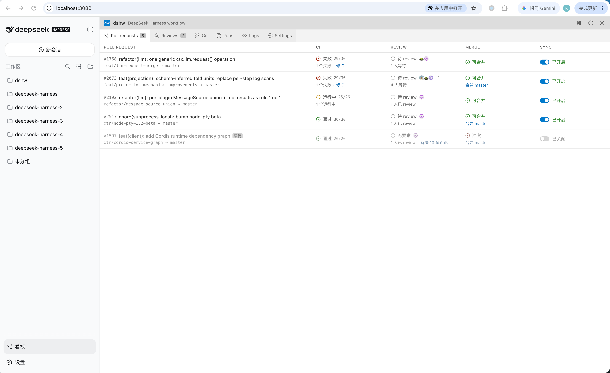

# dshw

> 个人开源项目，非 DeepSeek 官方产品。

`dshw` 是 DeepSeek Harness 的本机 PR 工作流工具，以看板形式嵌入 Harness Web。它会自动追踪你创建的 PR，克隆到本地独立目录，持续同步目标分支、监控 CI，并在需要时用 dsh Agent 自动处理冲突合并、修复 CI 失败、解决 review 评论。



## 功能

- **Pull requests**：按仓库列出你创建的 open PR，展示 CI、review、合并与同步状态；冲突、落后、失败检查都有一键或自动处理入口
- **Reviews**：列出待你 review 的 PR
- **Git**：仓库分支与提交历史可视化
- **Jobs**：后台任务列表与详情，运行中的任务可 steer、暂停、终止
- **Logs**：服务与任务日志
- **Settings**：
  - **Repos**：选择要监控的 GitHub 仓库（勾选并排序，顺序即各页展示顺序）
  - **Workers**：配置 dsh / Codex 等执行器
  - **System**：更新 dshw、同步主仓库、清理过期 worktree

支持同时监控多个仓库；新增仓库后，它的 PR 会被自动发现并展示。

## 安装

### 前置条件

- macOS
- Node.js 24+
- pnpm
- Git
- GitHub CLI，并已运行 `gh auth login`
- DeepSeek Harness

### 步骤

```sh
git clone https://github.com/kermanx/dshw.git
cd dshw
pnpm install
pnpm dshw start          # 初始化并后台启动服务
```

首次启动会准备托管仓库与运行时、构建插件、注册 LaunchAgent，可能需要几分钟。

然后把看板装进你的 dsh：

```sh
dsh plugin --profile web add "$PWD"
```

重启你的 dsh Web 服务（停掉后重新运行 `dsh web`），刷新页面即可在左侧栏看到看板入口。插件列表在启动时组装，新增插件必须重启 dsh web 才会生效。

## 使用要点

- 看板数据由本机后台服务实时提供，无需手动刷新
- 服务默认监听 `127.0.0.1:7849`，可用环境变量 `DSHW_PORT` 修改；换端口后在看板的连接失败界面修改服务地址即可
- **更新**：`git pull` 后运行 `pnpm dshw restart`，再重启 dsh web
- **卸载**：`dsh plugin --profile web remove dshw`，再重启 dsh web

## Worker 配置

Settings 的 **Workers** 页可以维护多个执行器配置并拖动排序，第一项即默认执行器。支持：

- **dsh**：填写 Provider、模型、API Key 等即可使用
- **Codex**：使用本机 Codex CLI 与登录状态
- **Claude Code**：仅保留入口，尚未接入

直接输入的 API Key 不会出现在配置文件里，而是以受限权限单独保存。PR 操作按钮左键使用默认执行器，右键可为本次任务选择其他执行器。

## 任务控制

运行中的任务可以：

- **Steer**：在下一个 step 前插入指令
- **暂停 / 继续**：暂停当前 turn，输入新指令后继续同一个任务
- **终止**：结束任务

daemon 重启后会重新接管运行中的任务。

## 安全与运维

- dshw 只注册当前用户的 LaunchAgent，不使用 sudo，不创建系统级服务
- 所有数据都在仓库的 `.dshw/` 目录内（已被 Git 忽略）
- worker 使用独立的运行环境，不会写入你的全局配置
- 每份 clone 有独立身份；不同安装互不干扰，冲突操作会明确拒绝

### 常用命令

```sh
pnpm dshw start      # 初始化并启动
pnpm dshw stop       # 停止
pnpm dshw restart    # 构建插件并重启
pnpm dshw status     # 查看状态
pnpm dshw code       # 打开当前分支对应的 worktree
pnpm dshw doctor     # 检查环境
```

## 开发

```sh
pnpm check     # 类型检查 + 构建 + 测试
```

修改正式服务代码后运行 `pnpm dshw restart`。
